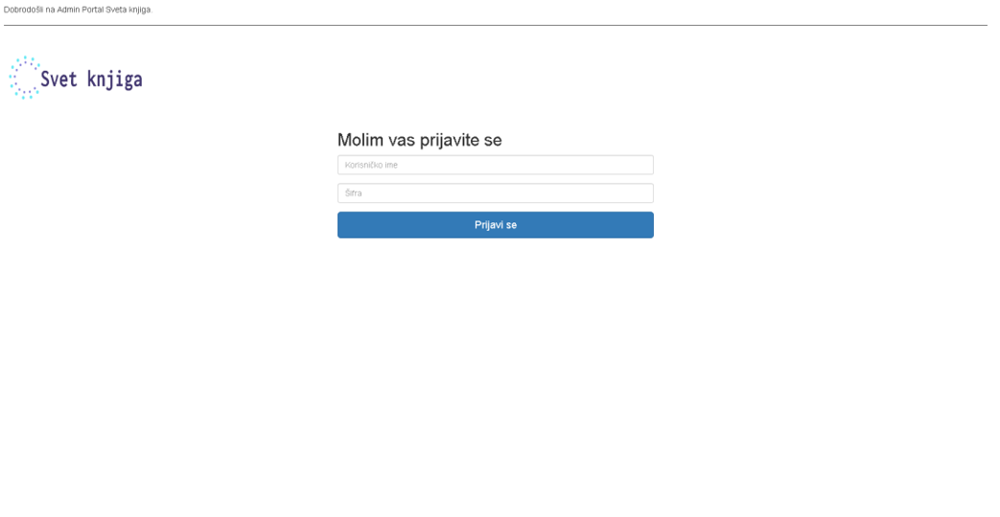
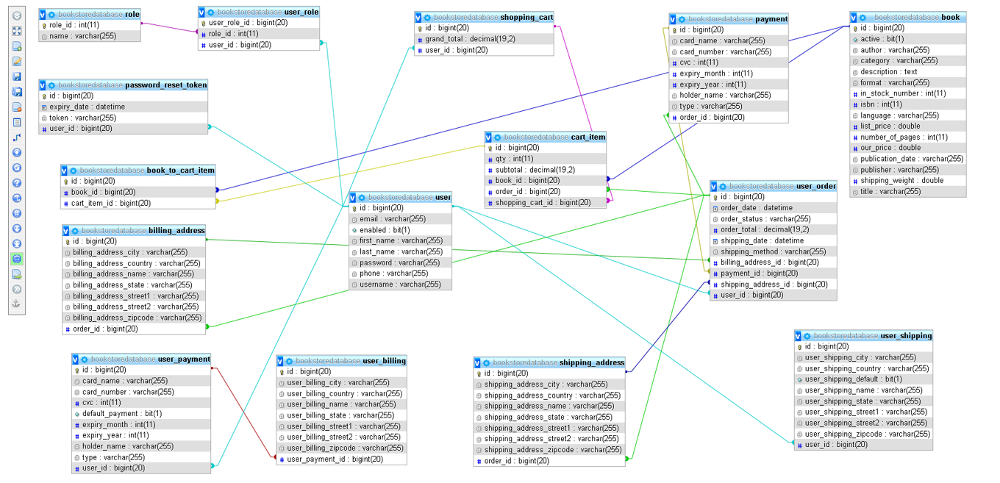

# Bookstore - Admin portal

This is an e-commerce web application built using Java, Spring, Hibernate and MySQL. 

Bookstore is a simple Java Spring Boot application to store and sell books.
 The project was built focusing the MVC pattern. It is divided into two
 individual modules, admin and
[user](https://github.com/bromazepam/bookstoreMaster)
 part. Both running independently and using the same database. 
 
 ## Built With
 
 * [Java 1.8](https://www.oracle.com/technetwork/java/javaee/downloads/jdk8-downloads-2133151.html)
 * [Spring Boot](https://spring.io/projects/spring-boot)
 * [Maven](https://maven.apache.org/)
 * [Thymeleaf](https://www.thymeleaf.org/)
 * [MySQL](https://www.mysql.com/)
 * [JPA](https://spring.io/guides/gs/accessing-data-jpa/)
 * [Hibernate](https://hibernate.org/)
 
 # Functionality

 * Addition of book
 * Get All Books
 * Get book by Id
 * Update a book
 * Remove a book/books

 
 ## Running the application locally
 
 There are several ways to run a Spring Boot application on your local machine. One way is to execute the `main` method in the `com\adminportal\AdminportalApplication.java` class from your IDE.
 
 Alternatively you can use the [Spring Boot Maven plugin](https://docs.spring.io/spring-boot/docs/current/reference/html/build-tool-plugins-maven-plugin.html) like so:
 
 ```shell
 mvn spring-boot:run
 ```

By default, the app runs on port: `8081`. You can open up the admin ui from following url: `http://localhost:8081`.
Login credentials are username: `admin`, password: `admin`
## Application screenshots


*login page*

## Application ER diagram
